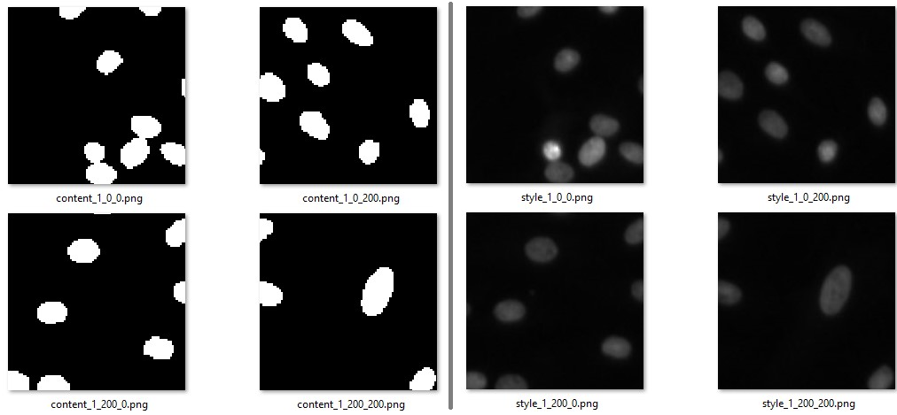

# ExpertDrivenNuclei

Implementation of "An Expert-driven Data Generation Pipeline for Histological Images".

This repo uses [AdaIN](https://github.com/naoto0804/pytorch-AdaIN/) and [HoVerNet](https://github.com/vqdang/hover_net) in order to complete the pipeline and evaluate the generated datasets.

## Replicating the generation pipeline

### Preparing the datasets
To prepare the public data, download the datasets described in `public_datasets_selection.ipynb`, unzip them and run the notebook changing the `base_dir` path.

Once a unified representation is obtained, run the `masks_to_HoVerNet.py` script to convert all annotations to the format required for training HoVerNet. `split_dataset.py` can be then used to split the dataset in the given subsets.

### Training AdaIN
To train the style transfer, select a subset of images associated to their flattened ground truths:

Follow the instructions available [here](https://github.com/naoto0804/pytorch-AdaIN/#train), selecting as `content_dir` the one containing the flattened masks and as `style_dir` the one with real images.

Our pipeline uses the last decoder checkpoint.

### Generating synthetic datasets
A new dataset can be generated by running `generate_dataset.py`. The script requires as parameters:
- `real_path`: the path to the folder containing real images in HoVerNet format (i.e., the folder should contain an `Images` and a `Labels` folders)
- `adain_path`: the path to the folder containing the AdaIN repo (for calling the inference script)
- `adain_decoder_path`: the path to the trained decoder (e.g. `decoder_iter_160000.pth.tar`)
- `styles_path`: folder containing target styles for AdaIN

For a complete list of available parameters, launch the script with the `-h` option.

### HoVerNet training and evaluation
New datasets are already generated in a format compatible with HoVerNet. To train the segmentation network, follow [HoVerNet's instructions](https://github.com/vqdang/hover_net#training). Set also in `config.py`:
- `nr_type = None`
- `self.type_classification = False` 
- `self.dataset_name = "cpm17"`
to use the correct annotation format and perform only segmentation.

HoVerNet evaluation was performed with the following metrics (already available in the framework):
- DICE
- DICE2
- AJI
- AJI+